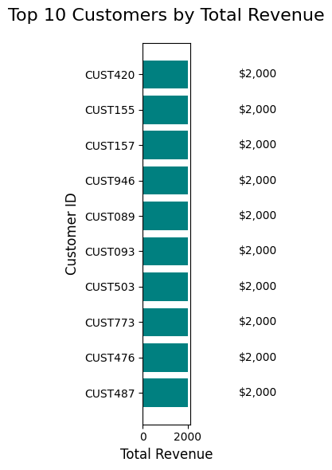
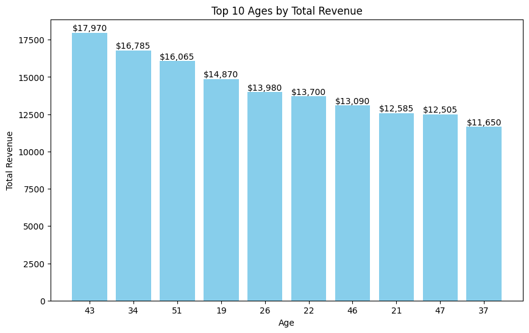
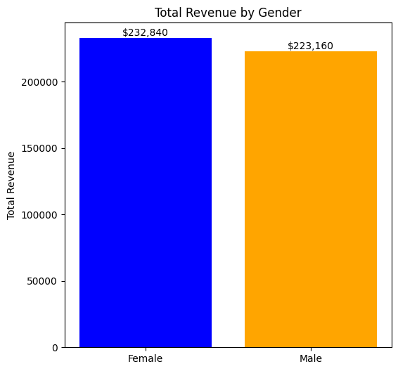
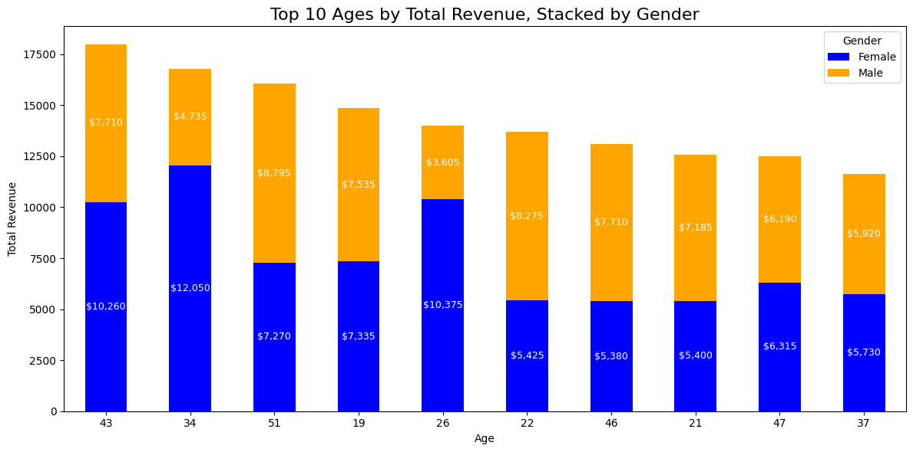
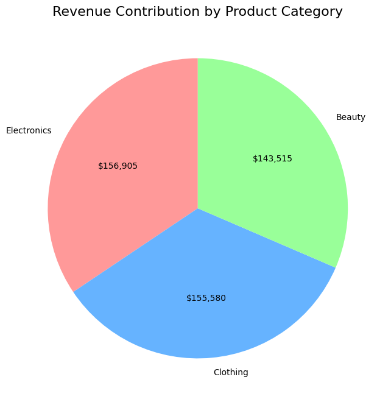
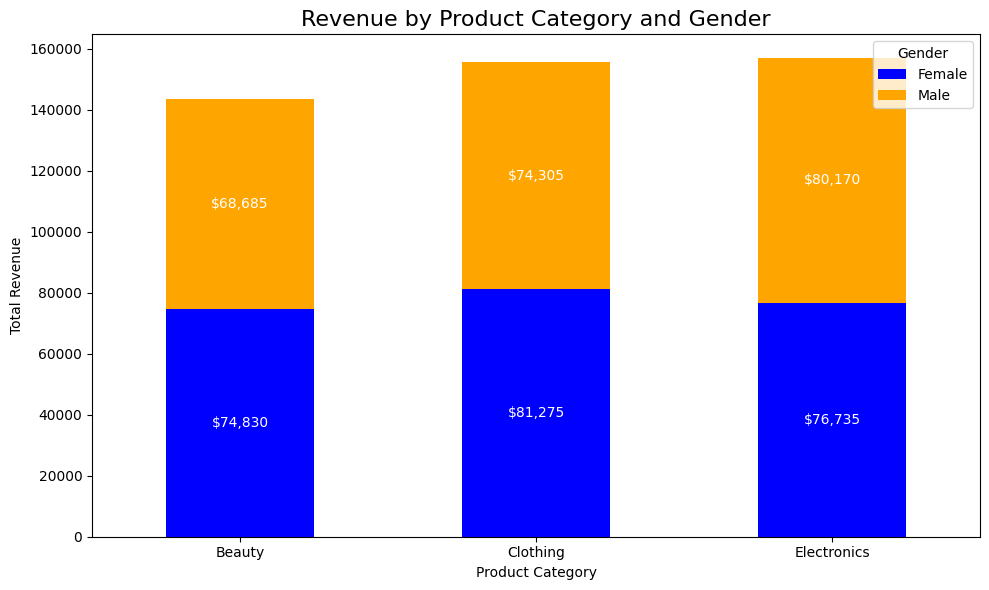
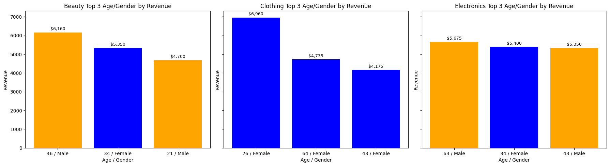
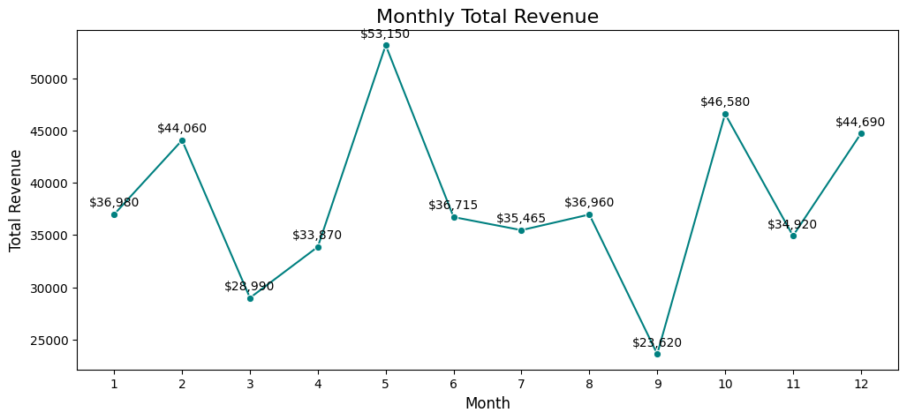
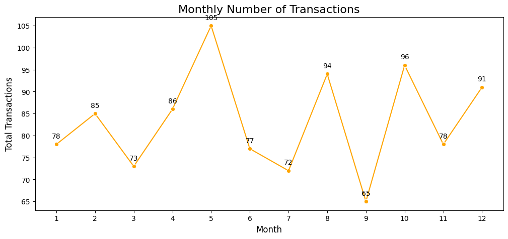

# **Retail Sales Exploratory Data Analysis in Python**

## Project Goal: Helping Retail Businesses Turn Data Into Decisions

This project is built for **retail business owners and e-commerce managers** in fashion, beauty, or electronics who want fast, actionable insights from their sales data.

Too often, I hear:  

> *“We have tons of sales data, but no time or tools to analyze it.  
> I don’t know which customers are most valuable, which products drive repeat purchases, or when to run promotions.  
> I need quick, clear insights to guide decisions without hiring a full data team.”*

This project explores a fictional retail dataset to uncover insights on customer behavior, product performance, and seasonal trends designed to help teams act faster, smarter, and with confidence.

## Business Impact Summary
- Identified high-value customer segments for targeted loyalty campaigns
- Revealed seasonal revenue peaks to guide inventory and promotion timing
- Uncovered bundling opportunities to lift revenue in low-margin months
- Delivered strategic recommendations aligned with cost-saving and growth

👉 Check out the full code in this **[Kaggle Notebook](https://www.kaggle.com/code/wilfridawere/retail-sales-eda-in-python)**

I use the same dataset, to perform **[Retail Sales EDA in SQL](https://www.kaggle.com/code/wilfridawere/retail-sales-eda-in-sql)**

## 📑 Table of Contents
1. [Key Insights](#-key-insights)
2. [Recommendations](#-recommendations)
3. [Client Scenario: Applying the Recommendations](#-client-scenario-applying-the-recommendations)
4. [Who Can Use This Project](#-who-can-use-this-project)  
5. [Tech Stack](#%EF%B8%8F-tech-stack)  
6. [Workflow](#-workflow)  
7. [Key Learnings](#-key-learnings)  
8. [Let’s Connect](#-lets-connect)  

## Overall KPIs

| Metric                     | Value          |
|-----------------------------|---------------|
| Total Revenue               | $456,000      |
| Total Transactions          | 1,000         |
| Avg Transaction Value       | $456          |
| Age Range                   | 18–64         |
| Price per Unit Range        | $25–500       |
| Transaction Amount Range    | $25–2,000     |

## 🔑 Key Insights

## Question 1: Who are our most valuable customers?

**Key Insights:**
- **High Revenue Individuals:** Top 10 customers each contributed $2,000, far above the average transaction value ($456).
- **Product Preference:** Electronics and Clothing appear most frequently among top customers, suggesting repeat or high-value transactions.
- **Age & Gender Distribution:** Top customers are aged 22–62, with both males and females represented.

**Charts:**  

---

## Question 2: How does customer age and gender influence purchasing behavior?

**Key Insights:**
- **Age Trends:** Middle-aged customers (34–51) drive revenue via consistent transactions.
- **High-Value Buyers:** Younger customers (19–37) make fewer but larger purchases.
- **Gender Patterns:** Females slightly outspend males ($232,840 vs $223,160), with similar average transaction values (~$456).
- **Top Age-Gender Combinations:** Female 34–26 and Male 46–51 segments show highest total revenue.

**Charts:**  

---

## Question 3: Which product categories drive the most revenue?

**Key Insights:**
- Electronics generate the highest revenue overall, slightly ahead of Clothing.
- Beauty has highest average transaction value ($467).
- Female buyers dominate Clothing and Beauty; males favor Electronics.
- Older males (46–63) drive high-revenue Electronics and Beauty; women 25–64 drive Clothing revenue.

**Charts:**  

---

## Question 4: Monthly trends in sales and transactions

**Key Insights:**
- **Peak months:** May ($53,150) and October ($46,580).
- **Low months:** September ($23,620) and March ($28,990).
- **Average transaction value peaks:** February ($518), July ($493), December ($491).

**Charts:**  

---

## Question 5: Patterns in purchase quantity per transaction

**Key Insights:**
- Average quantity per transaction: 2.51.
- Clothing purchases slightly higher quantity; Electronics lowest.
- Peaks occur for Clothing in months 3 & 9; Electronics in Feb, June, Oct.

**Charts:**  

---

## Question 6: How does pricing affect purchasing behavior?

**Key Insights:**
- High-priced products ($300–$500) generate most revenue despite fewer transactions.
- Low-priced products ($25–$50) have more transactions but less total revenue.
- Average quantity per transaction remains stable (~2.4–2.6), showing price does not deter unit purchases.

## ✅ Recommendations 
These recommendations are based on a full analysis of customer behavior, product performance, seasonal trends, and pricing sensitivity. Each one is **specific, time-bound**, and **ready to implement** using lightweight tools and workflows.

> **🛠️ How to Use This Section:**  
> As a retail manager, you don’t need to implement everything at once.  
> Use this section as a **decision support guide**—pick the strategies that fit your current goals, season, and customer base.  
> Whether you're planning a campaign, adjusting inventory, or refining pricing, these insights give you **clarity and direction** so you can act faster, smarter, and with confidence.

### 🧍‍♀️ Customer Loyalty & Segmentation

- **Launch a VIP program** for customers who’ve spent over $1,500 in the past 6 months  
  → Offer early access to Electronics (Feb, Oct) and exclusive Clothing bundles (March, Sept)

- **Send personalized offers** to top 10% customers  
  → Use email/SMS tools to recommend products based on past purchases and seasonal trends

- **Segment campaigns by age-gender clusters**  
  → Female 34–46: Clothing & Beauty  
  → Male 46–63: Electronics + Beauty  
  → Younger buyers (19–37): High-ticket Electronics with flexible payment options

### 🛍️ Product Bundling & Promotions

- **Bundle low-margin Clothing with high-margin Beauty**  
  → Target March & September with “Back-to-style” kits (e.g., jackets + skincare)

- **Upsell Electronics accessories** during high-quantity months  
  → February, June, October: Bundle smartwatches with chargers, bands, or cases

- **Create seasonal bundles based on quantity trends**  
  → March & September: Clothing bundles (3+ items)  
  → February: Electronics multi-unit offers (“Buy 2, get 10% off”)

### 📅 Seasonal Planning & Inventory

- **Stock up for May and October**, your highest revenue months  
  → Prioritize Electronics and Clothing; launch campaigns 2–3 weeks early

- **Reposition September as a volume-driven month**  
  → Clothing sells most but earns least—use bundling and upselling to lift revenue

- **Use December for gift bundles**, not premium Electronics  
  → Focus on curated Beauty and Clothing sets with loyalty perks

### 💰 Pricing Strategy

- **Promote high-ticket Electronics in February**  
  → Quantity per transaction peaks—ideal for bundling and tiered pricing

- **Use low-priced items ($25–$50) as entry points**  
  → Drive volume, then upsell via bundles or loyalty rewards

- **Avoid premium Electronics pushes in December**  
  → Quantity is low—focus on Beauty and Clothing upsells instead

### ⚙️ Operational Efficiency

- **Automate segmentation and outreach**  
  → Use n8n or Zapier to trigger campaigns based on spend, product interest, or season

- **Monitor age-gender-product intersections**  
  → Build dashboards to refine targeting and inventory decisions in real time

## 🧩 Client Scenario: Applying the Recommendations  
Let’s say you manage a mid-sized fashion and electronics store with seasonal promotions and a growing loyalty base. Here’s how you could apply the recommendations in real life:

### 🎯 Goal: Boost February Sales with High-Margin Electronics

- Identify top male customers aged 46–63  
- Launch a “Smart Tech Bundle” campaign: smartwatch + charger + case  
- Offer tiered discounts: Buy 2, get 10% off; Buy 3, get 15% off  
- Send personalized SMS offers to high spenders

**Why it works:**  
February has the highest Electronics quantity per transaction. Older males favor high-ticket items. Bundling lifts revenue without increasing acquisition costs.

### 🧥 Goal: Lift September Revenue Despite Low Margins

- Bundle popular Clothing items (jackets, tops) with Beauty accessories  
- Promote “Back-to-Style” kits via email and Instagram  
- Target female customers aged 34–46 with curated sets  
- Offer free shipping for bundles over $100

**Why it works:**  
September has high Clothing volume but low revenue. Bundling with Beauty increases average transaction value. Targeting high-revenue segments improves campaign ROI.

### 📦 Goal: Prepare Inventory for May and October Peaks

- Analyze top-selling Electronics and Clothing SKUs from previous May and October  
- Increase stock 2–3 weeks ahead of each peak  
- Schedule loyalty emails with early access offers  
- Use dashboards to monitor age-gender-product trends in real time

**Why it works:**  
May and October are revenue peak months. Early access drives urgency and repeat purchases. Inventory alignment reduces stockouts and overstocking.

## 👥 Who Can Use This Project?

**1. Business Leaders / Managers**  
- Make fast, data-driven decisions on customers, products, and timing.

**2. Marketing & Sales Teams**  
- Plan targeted campaigns and seasonal promotions with confidence.

**3. Data Analysts / Data Enthusiasts**  
- Practice real-world EDA and build portfolio-ready insights.

**4. Learners / Students**  
- Learn how data drives business strategy and clear communication.

## ⚙️ Tech Stack
- **Python (Pandas, Matplotlib, Seaborn)** – Data cleaning, preprocessing, and exploratory analysis  
- **Kaggle Notebook** – End-to-end workflow combining code, analysis, and documentation

## 🔄 Workflow
1. **Raw Data** → [Kaggle Dataset: Retail Sales Dataset](https://www.kaggle.com/datasets/mohammadtalib786/retail-sales-dataset/data)  
2. **Data Cleaning & Preprocessing** → Performed in Python (Pandas) to handle missing values, fix formatting, and prepare data for analysis.  
3. **Exploratory Data Analysis (EDA)** → Conducted in Python using Pandas for aggregations and Matplotlib/Seaborn for identifying trends and patterns.  
4. **Visualization & Storytelling** → Built charts with Matplotlib and Seaborn to present insights in a clear, business-focused manner.  

## 📌 Key Learnings
- Handling missing and inconsistent data using **Pandas**.  
- Structuring cleaned datasets for **efficient analysis and aggregation**.  
- Applying **EDA techniques** to uncover trends and patterns.  
- Creating **visualizations with Matplotlib & Seaborn** to communicate business insights.  

## 🔗 Let’s Connect

If my work was helpful or inspiring, feel free to connect, follow, or support:  

  
  
  
  
  
