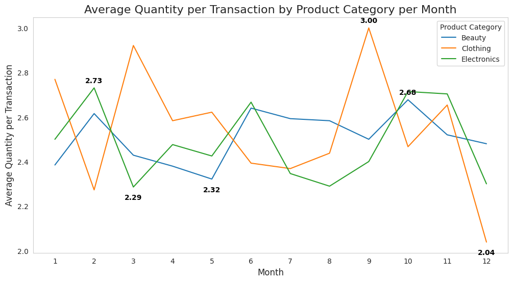

# **Retail Sales Exploratory Data Analysis in Python**

## Project Goal
This project explores a fictional **[Retail sales dataset](https://www.kaggle.com/datasets/mohammadtalib786/retail-sales-dataset/data)** to uncover actionable insights on **customer behavior, product preferences, and sales trends**. The aim is to help business leaders make data-driven decisions regarding marketing, inventory, pricing, and customer engagement.

The analysis will answer the following key questions:

1. Who are our most valuable customers?
2. How does customer age and gender influence purchasing behavior?
3. Which product categories drive the most revenue?
4. Monthly trends in sales and transactions
5. What are the patterns in purchase quantity per transaction?
6. How does pricing affect purchasing behavior?

👉 Check out the full code in this **[Kaggle Notebook](https://www.kaggle.com/code/wilfridawere/retail-sales-eda-in-python)**

I use the same dataset, to perform **[Retail Sales EDA in SQL](https://www.kaggle.com/code/wilfridawere/retail-sales-eda-in-sql)**

## 📑 Table of Contents
1. [Key Insights and Quick Recommendations](#-key-insights-and-quick-recommendations)  
2. [Who Can Use This Project](#-who-can-use-this-project)  
3. [Tech Stack](#%EF%B8%8F-tech-stack)  
4. [Workflow](#-workflow)  
5. [Key Learnings](#-key-learnings)  
6. [Let’s Connect](#-lets-connect)  

## Overall KPIs

| Metric                     | Value          |
|-----------------------------|---------------|
| Total Revenue               | $456,000      |
| Total Transactions          | 1,000         |
| Avg Transaction Value       | $456          |
| Age Range                   | 18–64         |
| Price per Unit Range        | $25–500       |
| Transaction Amount Range    | $25–2,000     |

## 🔑 Key Insights and Quick Recommendations
## Question 1: Who are our most valuable customers?

**Key Insights:**
- **High Revenue Individuals:** Top 10 customers each contributed $2,000, far above the average transaction value ($456).
- **Product Preference:** Electronics and Clothing appear most frequently among top customers, suggesting repeat or high-value transactions.
- **Age & Gender Distribution:** Top customers are aged 22–62, with both males and females represented.

**Quick Recommendations:**
- Launch VIP loyalty programs or exclusive offers for high-value customers.
- Highlight top-selling product categories (Electronics & Clothing) in campaigns.
- Offer targeted bundles or early access to high-value product releases.
- Personalized outreach (email/SMS) for top 10% customers.

**Charts:**  

---

## Question 2: How does customer age and gender influence purchasing behavior?

**Key Insights:**
- **Age Trends:** Middle-aged customers (34–51) drive revenue via consistent transactions.
- **High-Value Buyers:** Younger customers (19–37) make fewer but larger purchases.
- **Gender Patterns:** Females slightly outspend males ($232,840 vs $223,160), with similar average transaction values (~$456).
- **Top Age-Gender Combinations:** Female 34–26 and Male 46–51 segments show highest total revenue.

**Quick Recommendations:**
- Segment marketing campaigns by age & gender for better targeting.
- Offer premium upsells for high-transaction, high-value younger buyers.
- Launch loyalty programs for females aged 26–34.
- Target males 46–51 with promotions to increase transaction frequency.
- Use age-gender segmentation for personalized emails or bundles.

**Charts:**  

---

## Question 3: Which product categories drive the most revenue?

**Key Insights:**
- Electronics generate the highest revenue overall, slightly ahead of Clothing.
- Beauty has highest average transaction value ($467).
- Female buyers dominate Clothing and Beauty; males favor Electronics.
- Older males (46–63) drive high-revenue Electronics and Beauty; women 25–64 drive Clothing revenue.

**Quick Recommendations:**
- Target female buyers for Clothing & Beauty promotions.
- Target older males for Electronics promotions.
- Reward repeat buyers in high-revenue segments → increase customer lifetime value.

**Charts:**  

---

## Question 4: Monthly trends in sales and transactions

**Key Insights:**
- **Peak months:** May ($53,150) and October ($46,580).
- **Low months:** September ($23,620) and March ($28,990).
- **Average transaction value peaks:** February ($518), July ($493), December ($491).

**Quick Recommendations:**
- Schedule promotional campaigns before low-revenue months.
- Capitalize on high-revenue months with new product launches.
- Align inventory & logistics with seasonal peaks to avoid stockouts.
- Analyze February, July, December high-value purchases → design targeted campaigns.

**Charts:**  

---

## Question 5: Patterns in purchase quantity per transaction

**Key Insights:**
- Average quantity per transaction: 2.51.
- Clothing purchases slightly higher quantity; Electronics lowest.
- Peaks occur for Clothing in months 3 & 9; Electronics in Feb, June, Oct.

**Quick Recommendations:**
- Plan inventory for peak months per category.
- Offer bundle deals to encourage repeat purchase.
- Clothing bundle promotions during March & September → increase average quantity per transaction by 0.3 units.
- Electronics seasonal bundles in Feb, June, Oct → increase basket size and revenue.
- Cross-sell Beauty with Clothing/Electronics in peak months → improve overall transaction value.

**Charts:**  

---

## Question 6: How does pricing affect purchasing behavior?

**Key Insights:**
- High-priced products ($300–$500) generate most revenue despite fewer transactions.
- Low-priced products ($25–$50) have more transactions but less total revenue.
- Average quantity per transaction remains stable (~2.4–2.6), showing price does not deter unit purchases.

**Quick Recommendations:**
- Focus marketing on high-value products ($300–$500).
- Bundle low-price items to encourage larger basket sizes.
- Premium promotions for Electronics & Beauty.
- Stock planning for high-value items → each sale significantly impacts revenue.
- Test dynamic pricing on mid-tier items ($300) to optimize revenue.

**Charts:**  
*Insert revenue vs price charts per product category.*

## 👥 Who Can Use This Project?

**1. Business Leaders / Managers**  
- Quickly identify top-performing customers and revenue-driving segments.  
- Make data-driven decisions on promotions, inventory, and product strategy.  
- Track KPIs like Total Revenue, Avg Transaction Value, and Top Customers.  

**2. Marketing & Sales Teams**  
- Plan targeted campaigns by age, gender, and product category.  
- Identify high-value segments for upsells, bundles, or loyalty programs.  
- Optimize timing of promotions based on seasonal sales trends.  

**3. Data Analysts / Data Enthusiasts**  
- Learn real-world EDA techniques on transactional datasets.  
- Practice visualizing customer and sales data for actionable insights.  
- Build portfolio-ready projects with clear KPIs and insights.  

**4. Learners / Students**  
- Understand how EDA supports business decision-making.  
- Practice summarizing KPIs, insights, and recommendations.  
- Learn how to present findings visually and clearly for business audiences.  

## ⚙️ Tech Stack
- **Python (Pandas, Matplotlib, Seaborn)** – Data cleaning, preprocessing, and exploratory analysis  
- **Kaggle Notebook** – End-to-end workflow combining code, analysis, and documentation

## 🔄 Workflow
1. **Raw Data** → [Kaggle Dataset: Retail Sales Dataset](https://www.kaggle.com/datasets/mohammadtalib786/retail-sales-dataset/data)  
2. **Data Cleaning & Preprocessing** → Performed in Python (Pandas) to handle missing values, fix formatting, and prepare data for analysis.  
3. **Exploratory Data Analysis (EDA)** → Conducted in Python using Pandas for aggregations and Matplotlib/Seaborn for identifying trends and patterns.  
4. **Visualization & Storytelling** → Built charts with Matplotlib and Seaborn to present insights in a clear, business-focused manner.  

## 📌 Key Learnings
- Handling missing and inconsistent data using **Pandas**.  
- Structuring cleaned datasets for **efficient analysis and aggregation**.  
- Applying **EDA techniques** to uncover trends and patterns.  
- Creating **visualizations with Matplotlib & Seaborn** to communicate business insights.  

## 🔗 Let’s Connect

If my work was helpful or inspiring, feel free to connect, follow, or support:  

  
  
  
  
  
